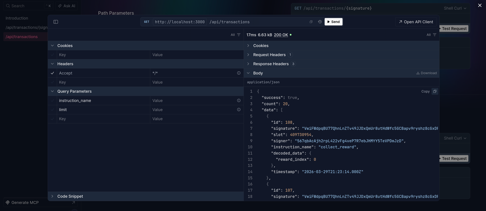

# ⚡ NextIndex: Solana Program Indexer

A high-performance, containerized Solana program indexer built with **Bun**, **ElysiaJS**, and **Drizzle ORM**. It fetches transactions via RPC, decodes instruction data using Anchor IDL, stores them in a MySQL database, and exposes them through a beautifully documented REST API.

Built for the **Superteam Ukraine Bounty**.



---

## 🏗 Architecture Overview

- **Core Engine:** A polling background worker (`SolanaIndexer`) that continuously fetches new transactions for a specific `PROGRAM_ID`.
- **Smart Decoding:** Utilizes `@coral-xyz/anchor` (`BorshInstructionCoder`) to parse raw base58 bytes into human-readable JSON. Supports both local `program_idl.json` and dynamic on-chain IDL fetching.
- **Rate-Limit Resilient:** Implements strategic micro-delays and single-fetching mechanisms to bypass public RPC `429 Too Many Requests` and free-tier `403 Forbidden` batch errors.
- **Database:** **MySQL** managed by **Drizzle ORM** for strict typing and fast queries.
- **REST API:** Powered by **ElysiaJS** and **Bun** for maximum speed, featuring auto-generated Swagger (Scalar) documentation.

---

## 🚀 Setup & Launch

The entire infrastructure (Database + Indexer + API) is dockerized and runs with a single command.

### 1. Prerequisites

- [Docker](https://www.docker.com/) & Docker Compose installed.

### 2. Environment Variables

Clone the repository and create a `.env` file in the root directory. Fill in the variables as shown below:

```env
RPC_URL=https://api.mainnet-beta.solana.com
PROGRAM_ID=whirLbMiicVdio4qvUfM5KAg6Ct8VwpYzGff3uctyCc  # Example: Orca Whirlpools
IDL_ADDRESS=whirLbMiicVdio4qvUfM5KAg6Ct8VwpYzGff3uctyCc
```

> 💡 **Recommended:** Use a [Helius](https://helius.dev) RPC URL instead of the public endpoint — it's significantly faster, more stable, and avoids rate-limiting during indexing. Free tier is more than enough to get started.

### 3. Start the Application

Run the following command to build the image, start MySQL, run Drizzle migrations, and boot the API:

```bash
docker compose up --build -d
```

- The indexer will start logging in the background.
- Swagger UI docs will be available at: **http://localhost:3000/api/swagger**

---

## 🌐 API Examples

### Get a transaction by signature

```bash
curl -X GET "http://localhost:3000/api/transactions/5ojHZrUk6ye44uMXAtyHAAipAan7P3woqt2wp95T1u7ykfoe3y7Zy5AHUaoV2HfeiBqrWPZvLsWnM3Q5JRPZhRvZ"
```

### Get a list of transactions (with filters)

```bash
# Get 5 latest 'swap' instructions
curl -X GET "http://localhost:3000/api/transactions?instruction_name=swap&limit=5"

# Filter by a specific signer
curl -X GET "http://localhost:3000/api/transactions?signer=YOUR_WALLET_ADDRESS"
```

---

## 🧠 Key Technical Decisions & Trade-offs

| Decision | Rationale |
|---|---|
| **Bun + Elysia** over Node.js + Express | Significantly better performance, built-in TypeScript support, and elegant Swagger integration. |
| **Drizzle ORM** over Prisma | Closer-to-SQL syntax, no heavy Rust engine — keeps the Docker image lighter and migrations faster. |
| **Single-fetching** over Batching | `getParsedTransactions` gets blocked by free-tier RPCs (Helius, etc.). Iterating signatures individually with a 150ms delay is slower for historical backfill but 100% reliable and crash-proof. |